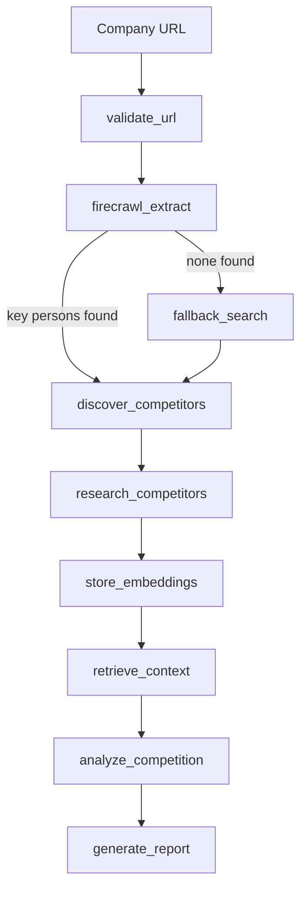

# 🚀 CompetitorIQ

> AI-powered competitive intelligence platform that researches a company, discovers competitors, performs SWOT analysis, and generates actionable market insights from a single company URL.

Built with LangGraph (Python), Groq, Firecrawl, Qdrant, and Next.js.

---

## ✨ Features

* 🔍 Automated company profiling from website URLs
* 🎯 AI-powered competitor discovery
* 📊 Competitor profiling and comparison
* 📈 SWOT analysis and market positioning
* 💬 Report chat assistant
* ⚡ Real-time progress tracking with SSE
* 📋 Structured executive intelligence reports

---

## 🏗️ Architecture

A single LangGraph graph runs in Python; the Next.js frontend talks to it over the
LangGraph server's HTTP API and streams node transitions back to the browser as SSE.



---

## 🛠️ Tech Stack

| Layer      | Technology                          |
| ---------- | ----------------------------------- |
| Frontend   | Next.js 15, Tailwind CSS, Framer Motion (TypeScript) |
| Workflow   | LangGraph (Python)                  |
| LLM        | Groq (Llama 3.3 70B)                |
| Scraping   | Firecrawl                           |
| Vector DB  | Qdrant                              |
| Validation | Pydantic v2                         |

---

## 📁 Layout

```
backend/          LangGraph graph — the only backend implementation
  src/graph.py    Compiled graph, referenced by langgraph.json
  src/nodes/      One module per graph node
  src/clients/    Groq, Firecrawl, Qdrant, embeddings
  demo.py         Run the graph locally without the server
frontend/         Next.js app (TypeScript)
langgraph.json    Points the LangGraph CLI at backend/src/graph.py
```

---

## 🚀 Getting Started

### Prerequisites

* Python 3.11+
* Node.js 20+
* Groq API key
* Firecrawl API key
* A Qdrant instance (local Docker or Qdrant Cloud)

### 1. Clone

```bash
git clone https://github.com/KoynaKarmakar/CompetitorIQ.git
cd CompetitorIQ
```

### 2. Configure environment

Create `.env` in the project root:

```env
GROQ_API_KEY=
FIRECRAWL_API_KEY=

# Local Docker. For Qdrant Cloud, include the REST port explicitly:
#   https://<cluster-id>.<region>.aws.cloud.qdrant.io:6333
QDRANT_URL=http://localhost:6333
QDRANT_API_KEY=

LANGCHAIN_TRACING_V2=false
LANGCHAIN_API_KEY=
LANGCHAIN_PROJECT=
```

Create `frontend/.env.local`:

```env
GROQ_API_KEY=
LANGGRAPH_API_URL=http://localhost:2024
```

### 3. Install the backend

```bash
cd backend
python -m venv .venv
source .venv/bin/activate      # Windows: .venv\Scripts\activate
pip install -r requirements.txt
pip install -e .               # installs the src package in editable mode
cd ..
```

### 4. Install the frontend

```bash
cd frontend
npm install
cd ..
```

### 5. Start Qdrant

```bash
docker run -p 6333:6333 qdrant/qdrant
```

Or point `QDRANT_URL` at a Qdrant Cloud cluster — **including the `:6333` port**.
Cloud dashboard URLs are shown without it, which resolves to `:443` and returns a
404 HTML page instead of the API.

### 6. Start the backend

Run this **from the project root** — the CLI resolves the graph path in
`langgraph.json` relative to the working directory, not to the config file, so
running it from `backend/` looks for `backend/backend/src/graph.py` and fails.

```bash
source backend/.venv/bin/activate
langgraph dev --config langgraph.json
```

Backend runs on `http://localhost:2024`.

### 7. Start the frontend

```bash
cd frontend
npm run dev
```

Frontend runs on `http://localhost:3000`.

### Quick local demo (no server needed)

```bash
cd backend
source .venv/bin/activate
python demo.py https://firecrawl.dev
```

---

## 🧪 Usage

1. Open the app and enter a company website URL.
2. Click **Analyze** and track progress in real time.
3. Explore the executive summary, company profile, competitor analysis, SWOT,
   market positioning, and strategic recommendations.
4. Use the chat interface to ask follow-up questions about the report.

---

## ⚙️ How It Works

**Company research** — scrapes the company homepage with Firecrawl, then uses Groq
to extract structured business information.

**Competitor discovery** — asks the LLM for 10 candidate competitors, then scrapes
them in order until 3 usable profiles are produced.

**Retrieval** — chunks and embeds company and competitor text into Qdrant, then
retrieves context for the analysis prompt.

**Competitive analysis** — produces SWOT, competitive advantages, market
positioning, and strategic recommendations.

---

## 🚧 Known Limitations

* Embeddings are a deterministic hash-based placeholder, not a semantic model —
  retrieval quality is correspondingly limited.
* The Qdrant collection is shared across runs and is not scoped per analysis.
* Competitor research runs sequentially rather than in parallel.
* Only the company homepage is scraped, so some profile fields are inferred.
* If every competitor scrape fails, placeholder profiles are used and the report
  does not distinguish them from researched ones.

## 🔭 Future Improvements

* Real embedding model
* Per-run collection scoping
* Parallel competitor research
* Multi-page crawling
* Historical tracking and scheduled monitoring
* PDF export

---

## 🙏 Credits

The initial company-research agent scaffold was adapted from
[Mayo Oshin](https://github.com/mayooear)'s LangGraph company researcher.
CompetitorIQ extends it with competitor discovery, retrieval, competitive
analysis, and the Next.js frontend.

## 👨‍💻 Author

**Koyna Karmakar** — AI/ML Engineer • LangGraph • RAG • LLM Applications

---

⭐ If you find this project useful, consider giving it a star.
